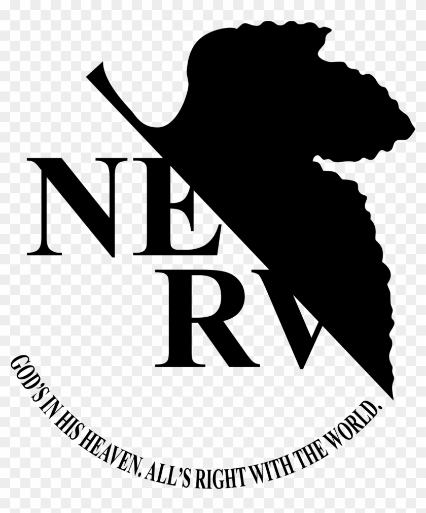

<div align="center">


<br/>



# ❄️ NEVERNET EDGE API

<p>
  
  
  
</p>

<p>
  
  
  
  
  
  
</p>


### `cold blue gateway between frontend and Rust microservices`

**Minimal. Precise. Dockerized. Swagger-ready.**

</div>

---

## `SYSTEM // OVERVIEW`

**NeverNet Edge API** — это Go-based HTTP gateway / BFF, который общается с Rust backend-сервисами по **gRPC**  
и держит внешний REST-контракт для фронта как замена `backend/apps/edge-api`.

Он нужен, чтобы:

- принимать HTTP/JSON запросы от фронта
- проксировать и агрегировать данные из Rust-сервисов
- отдавать единый REST API
- поднимать встроенный Swagger / OpenAPI
- быстро деплоиться в Docker на Linux

---

## `NERV // PRIMARY VISUAL`

<div align="center">


</div>

---

## `MAGI // DECISION MATRIX`

<table>
<tr>
<td width="33%" align="center">

### **MELCHIOR**
**Architecture**
Clean gateway layer  
Simple package layout  
Fast local iteration

</td>
<td width="33%" align="center">

### **BALTHASAR**
**Operations**
Dockerized runtime  
Health endpoints  
Env-based config

</td>
<td width="33%" align="center">

### **CASPER**
**Interface**
Swagger docs  
Stable REST contract  
Hackathon-ready workflow

</td>
</tr>
</table>

---

## `BLUE STATUS // LIVE TELEMETRY`

```text
SYSTEM        :: ONLINE
UNIT COLOR    :: BLUE
ROUTER        :: chi
TRANSPORT     :: HTTP <-> gRPC
UPSTREAM      :: Rust microservices
DOCS          :: /docs
OPENAPI       :: /openapi.json
AUTH MODE     :: COOKIE + CSRF
DEPLOY MODE   :: DOCKER
SIGNAL        :: STABLE
```

---

## `ENTRY PLUG // FEATURES`

```text
[✓] REST API gateway
[✓] gRPC bridge to Rust backend
[✓] Health / readiness endpoints
[✓] Swagger / OpenAPI docs
[✓] CSRF + cookie auth flow
[✓] Docker-ready runtime
[✓] Linux server deploy path
[✓] Fast startup for hackathon work
```

---

## `STRUCTURE // INTERNAL MAP`

```text
.
├── api/
├── assets/
│   ├── Ayanami.jpg
│   ├── lilith.jpg
│   ├── nerv-logo.jpg
│   └── rei-panel.webp
├── cmd/
│   └── edge-api/
├── gen/
├── internal/
│   ├── app/
│   ├── config/
│   ├── docs/
│   ├── grpcclient/
│   ├── handlers/
│   ├── middleware/
│   └── response/
├── .dockerignore
├── .env.example
├── .gitignore
├── buf.gen.yaml
├── buf.yaml
├── docker-compose.local.yml
├── Dockerfile
├── go.mod
├── go.sum
├── Makefile
└── README.md
```

---

## `LCL // QUICK START`

### Clone

```bash
git clone https://github.com/Denbay0/TestApi.git
cd TestApi
```

### Create env

**Linux / macOS**
```bash
cp .env.example .env
```

**Windows PowerShell**
```powershell
Copy-Item .env.example .env -Force
```

### Install dependencies

```bash
go mod tidy
```

### Run locally

```bash
go run ./cmd/edge-api
```

### Local endpoints

- `http://localhost:8080`
- `http://localhost:9100`

---

## `SEELE // OPENAPI ACCESS`

<div align="center">

| INTERFACE | URL |
|-----------|-----|
| **Swagger UI** | `http://localhost:8080/docs` |
| **OpenAPI JSON** | `http://localhost:8080/openapi.json` |
| **OpenAPI YAML** | `http://localhost:8080/openapi.yaml` |

</div>

---

## `NERV // HEALTH CHECK`

```bash
curl http://localhost:8080/health
curl http://localhost:8080/healthz
curl http://localhost:9100/health
```

---

## `DOGMA // VISUAL FEED`

<div align="center">


</div>

---

## `DEPLOYMENT // DOCKER PROTOCOL`

### Build

```bash
docker build -t edge-api:test .
```

### Run

```bash
docker run --rm -p 8080:8080 -p 9100:9100 --env-file .env edge-api:test
```

### Compose

```bash
docker compose -f docker-compose.local.yml up --build
```

### External network

```bash
docker network create rust-backend
```

---

## `GENOME // ENV CONFIG`

```env
PORT=8080
METRICS_PORT=9100
REDIS_URL=redis://redis:6379

IDENTITY_SERVICE_URL=http://identity-svc:50051
EVENT_COMMAND_SERVICE_URL=http://event-command-svc:50052
EVENT_QUERY_SERVICE_URL=http://event-query-svc:50053
REPORT_SERVICE_URL=http://report-svc:50054

FRONTEND_ORIGINS=http://localhost:3000,http://localhost:5173
AUTH_COOKIE_SECURE=false
```

---

## `COMMAND LIST // ENDPOINTS`

<details>
<summary><b>AUTH // EXPAND</b></summary>

<br/>

- `GET /api/auth/csrf`
- `POST /api/auth/register`
- `POST /api/auth/login`
- `POST /api/auth/logout`
- `GET /api/auth/me`

</details>

<details>
<summary><b>DATA // EXPAND</b></summary>

<br/>

- `GET /api/categories`
- `GET /api/events`
- `POST /api/events`
- `GET /api/calendar`
- `GET /api/dashboard`
- `GET /api/reports/summary`
- `GET /api/reports/by-category`
- `GET /api/settings`
- `PUT /api/settings`
- `GET /api/exports`

</details>

---

## `MARDUK // TARGET PROFILE`

```text
TARGET        :: Hackathon-ready gateway
PRIORITY      :: Fast delivery
DOC STATUS    :: Embedded Swagger
RUNTIME       :: Linux container
FAILURE MODE  :: Upstream unavailable
RECOVERY      :: Replace stubs with real gRPC contracts
```

---

> [!WARNING]
> Some upstream Rust service flows may still be stubbed or partially mocked.  
> Replace placeholder behavior with real protobuf/gRPC integrations before production deployment.

---

## `MAGI // VERDICT`

- **MELCHIOR:** architecture acceptable
- **BALTHASAR:** deployment stable
- **CASPER:** proceed to synchronization

---

## `DOGMA // GIT POLICY`

### tracked
- `go.mod`
- `go.sum`
- source code
- docs
- Docker files
- assets used by README

### ignored
- `.env`
- `vendor/`
- `*.exe`
- temp/build artifacts

---

## `SYNC GRAPH // ROADMAP`

```text
PHASE 01 :: gateway bootstrap          [DONE]
PHASE 02 :: docs / swagger             [DONE]
PHASE 03 :: docker runtime             [DONE]
PHASE 04 :: real protobuf integration  [PENDING]
PHASE 05 :: auth hardening             [PENDING]
PHASE 06 :: integration tests          [PENDING]
PHASE 07 :: production profile         [PENDING]
```

---

## `REI // BLUE QUOTE`

<div align="center">

> _Silence in the transport._  
> _Precision in the gateway._  
> _Stability in the build._


</div>
